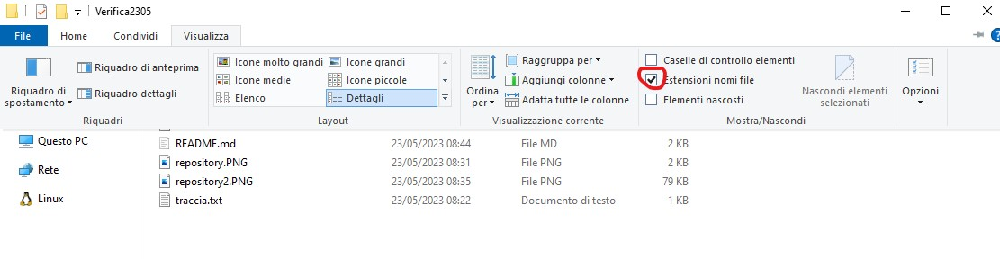
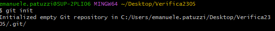
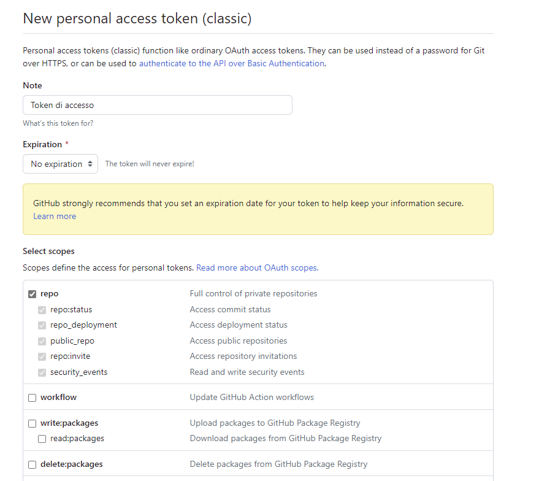
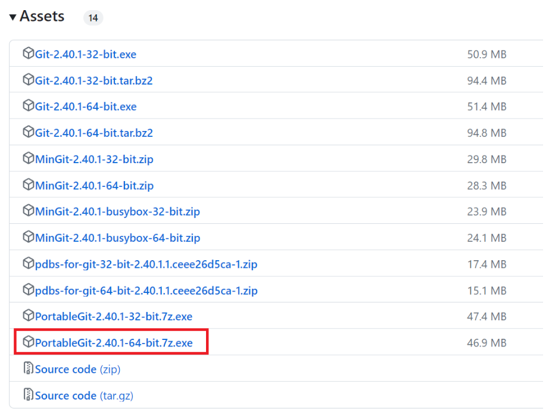
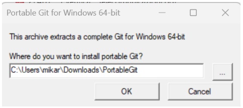
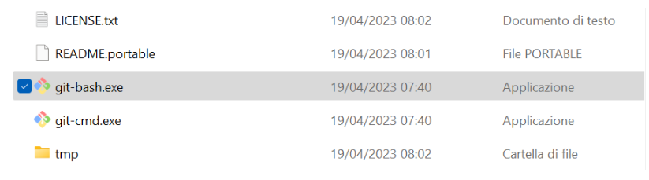

# PROVA DI VERIFICA
## Traccia Verifica

Facendo riferimento alla prova di informatica proposta da voi per l'esercitazione del 3/05 (https://classroom.google.com/u/0/c/MzIwODk0OTk2OTA3/a/NTE5NTY0MzE0NjM4/details), realizzare un repository Git contenente:
1. la traccia della prova che avete svolto (sia in un file .txt sia in una sezione del README.md),
2. il codice sorgente che avete caricato su Classroom,
3. un file README che contenga:

    3.1 una descrizione del codice;

    3.2 una sezione in cui vengono spiegati i comandi utilizzati per la creazione di questo repository in stile tutorial;

    3.3 le funzioni base di Git ed i comandi/funzioni utili per realizzare un README.md ordinato..

È possibile prendere spunto dal vostro svolgimento dell'esercitazione fatta in data 16/05.

## Traccia Esercitazione
Scrivere codice in java che permetta: 
- creare una linked list per la gestione di inserimento e rimozione numeri
- creare anche un metodo per visualizzare tutti gli elementi all'interno

##  Spiegazione Codice Esecitazione
codice tramite una likedlist gestisce
1. inserimento i dati tramite ```add```
2. permette di eliminare il primo tramite ```rimuoviPrima```
3. di visualizzare l'elenco dei dati tramite ```elenco```

# Passaggi Esercitazione

## 1. Creazione di un Nuovo Repository

andare su (https://github.com/) e cliccare sul tasto NEW


impostare il nome del repository e poi impostarlo come public e togliere la spunta sul "add README file"


## 2. Creazione del Workspace
### Creazione Cartella
andare sul desktop e creare una cartella 
1. facendo tasto destro
2. nuovo
3. cartella
4. dare il nome desiderato alla cartella


### Setup README.md
1. creare un file di testo in modo similare a quello della cartella
2. abilitare le estesioni dei file nella cartella

3. rinominare il file dopo il .

    

### Inizializzazione del Repository Locale
1. aprire il programma git Bash crecandolo nella barra di ricerca e facendo doppio click su esso (nel caso non dovrebbe esseci andare alla voce "INSTALLAZIONE Github")
2. eseguire il comando
```
cd Desktop/Verifica2305 
```


3. inizialliare la repository locale
```
git init
```


## 3. Sicronizzazione dei Repository
```
git add README.md  # Inserimento del file README.md nell'area di staging
git commit -m "first commit"  # Creazione del primo commit, che serve a sincronizzare il repository locale con lo stage
git branch -M main  # Creazione del branch main, da usare come default
git remote add origin https://github.com/<username>/<repositoryname>  # Connessione del repository remoto al repository locale
git push https://<username>:<token>@github.com/<username>/<repositoryname>.git #serve per sincornizzare il repository locale con quello remoto
```
(se non si ha un token andara alla sezione "Creazione di un Token")

## Installazione di github
- aprire il seguente link https://github.com/settings/tokens
- generare un token mediante `Generate new token (classic)`
    
- confermare l'accesso inserendo la propria password, se richiesto
- in `Note` inserire un messaggio come "token di accesso"
- `Expiration`: "No expiration"
- In `Select scopes` spuntare la casella accanto a `repo`, in modo tale da avere la situazione sottostante
- generare il token e salvarlo in un file di testo


## Intallazione PortableGit
Scaricare l'ultima versione di PortableGit: https://github.com/git-for-windows/git/releases/



Eseguire il file exe scaricato.



Aprire il programma `git-bash` nella cartella di PortableGit appena creata.


